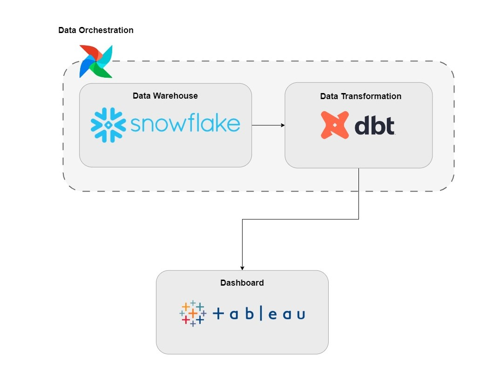
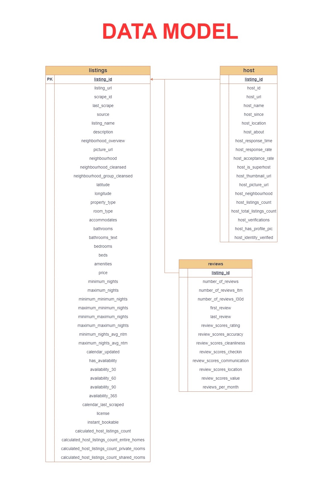
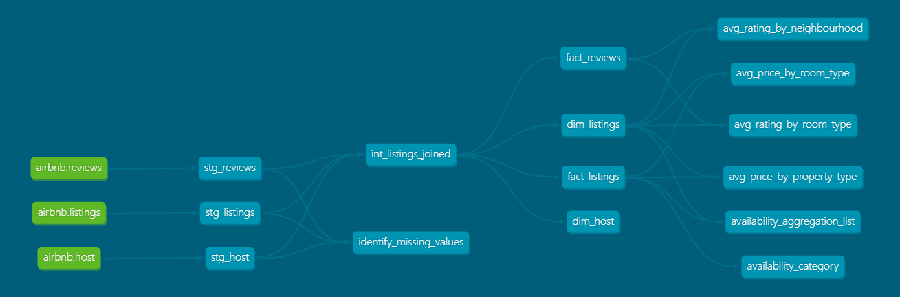
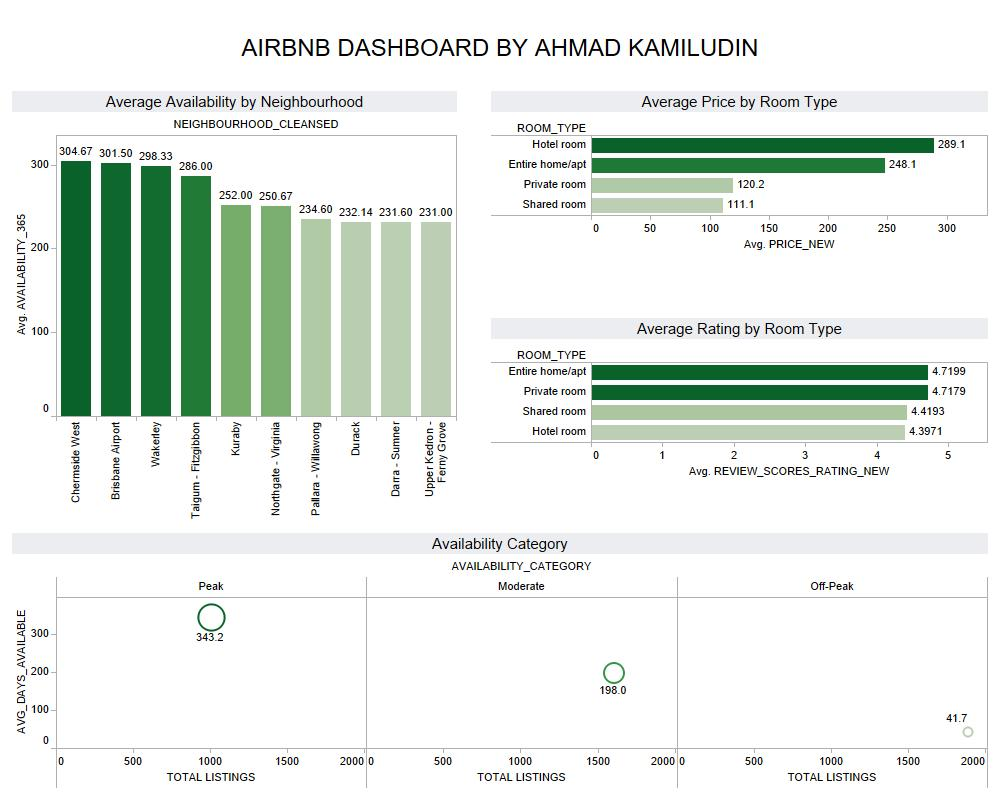

# Mastering Analytics Engineering with Airbnb Data Using Four Powerful Tools

## Introduction

This project showcases the seamless integration of key data engineering and analytics tools to analyze Airbnb listings in Brisbane, Australia. It begins with the setup and configuration of Snowflake and dbt, facilitating efficient data transformation processes. The journey continues with data modeling, testing, and transformation using dbt, followed by workflow automation using Airflow for streamlined task orchestration. Finally, the project concludes with the creation of insightful dashboards using Tableau, enabling visualization and exploration of Airbnb data for informed decision-making. Overall, this project offers practical experience in building end-to-end data pipelines and deriving actionable insights from complex datasets.

## Tech Stack 

## Data Modeling 

## Directed Acyclic Graph 

## Simple Dashboard

## Dataset Used
1. Airbnb listings in Brisbane, Australia
2. Website - https://insideairbnb.com/brisbane/
3. Data Dictionary - https://docs.google.com/spreadsheets/d/1iWCNJcSutYqpULSQHlNyGInUvHg2BoUGoNRIGa6Szc4/edit#gid=1322284596

## Article About this Project 
Medium Article - https://medium.com/@ahmadkamiludin/mastering-analytics-engineering-with-airbnb-data-using-four-powerful-tools-70ad6509c4d4
